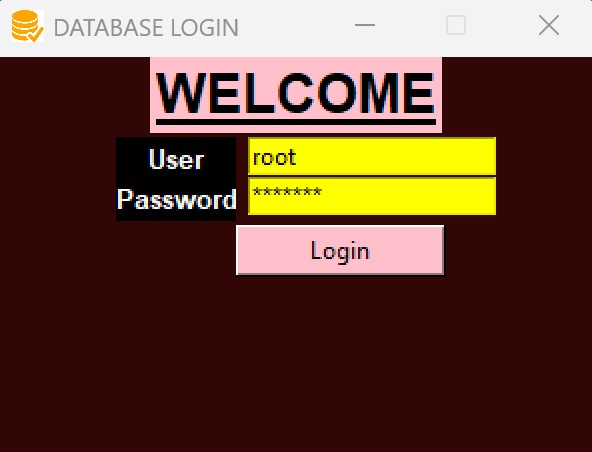
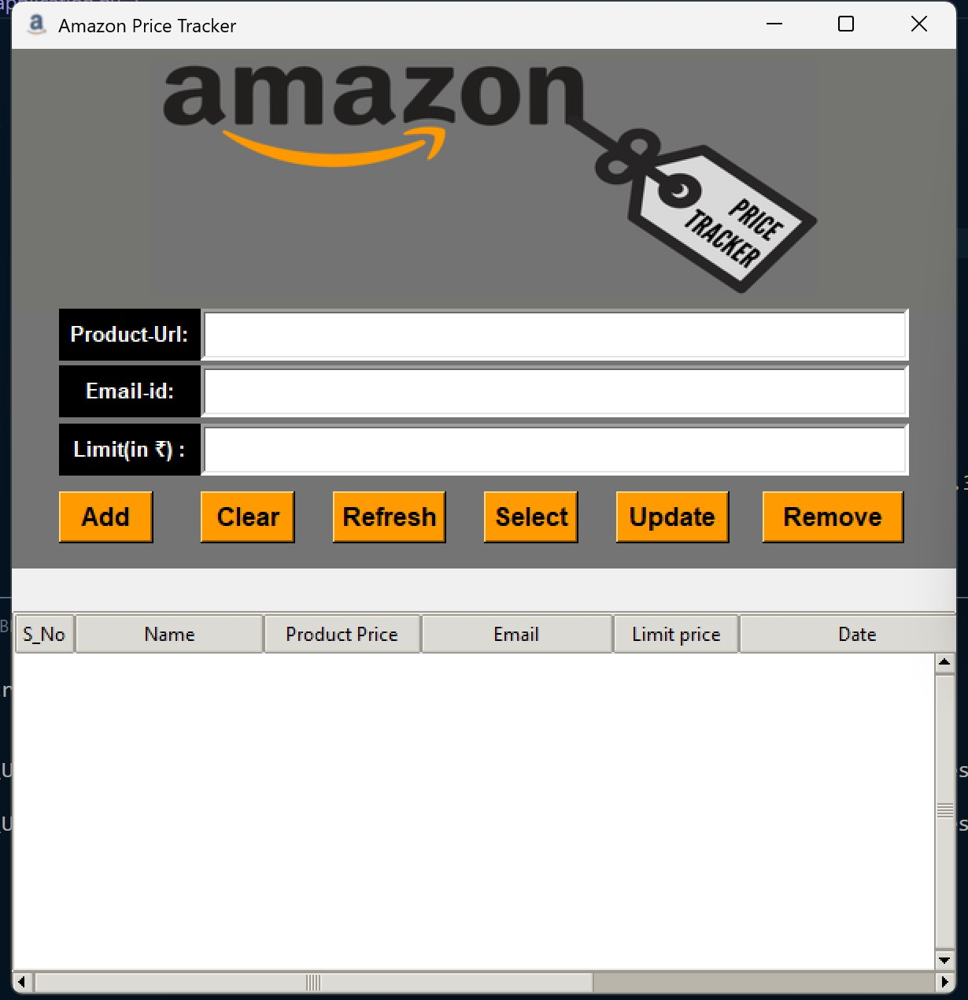
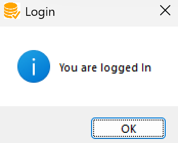

# Amazon Price Tracker

Amazon Price Tracker is a Python-based desktop application that enables users to monitor and track price changes of Amazon products. Developed using Tkinter for the graphical user interface and MySQL for data storage, this project was originally created as a Class 12 CBSE project, serving both educational and practical purposes.

## Features

- **Graphical User Interface (GUI):**  
  Provides a user-friendly interface built with Tkinter, including authentication and main dashboard windows.

- **Price Monitoring:**  
  Allows users to track price fluctuations of selected Amazon products, with data stored in a MySQL database for persistent storage.

- **Data Display:**  
  Retrieves data from the MySQL database and displays it in a tabular format within the GUI, facilitating easy data analysis.

## Screenshots

  
*Login window to authenticate users before accessing the main features.*

  
*The main dashboard displaying price tracking and monitoring functionalities.*

  
*Post-login view with access to additional features.*

## Installation

1. **Clone the repository:**

   ```bash
   git clone https://github.com/wigglevig/Amazon_Price_Tracker.git
   ```

2. **Navigate to the project directory:**

   ```bash
   cd Amazon_Price_Tracker
   ```

3. **Install required Python packages:**

   Ensure you have the necessary packages installed, including `mysql-connector-python` for MySQL connectivity and `tkinter` for the GUI.

   ```bash
   pip install mysql-connector-python
   ```

4. **Set up the MySQL database:**

   - Create a MySQL database named `amazon_price_tracker`.
   - Execute the following SQL command to create the `prices` table:

     ```sql
     CREATE TABLE prices (
         id INT AUTO_INCREMENT PRIMARY KEY,
         product_name VARCHAR(255) NOT NULL,
         current_price DECIMAL(10, 2) NOT NULL,
         last_checked TIMESTAMP DEFAULT CURRENT_TIMESTAMP
     );
     ```

   - Update the database connection settings in `application.py` to match your MySQL configuration.

5. **Run the application:**

   ```bash
   python application.py
   ```

*Note: This project uses Tkinter, which is included in standard Python distributions. Ensure that MySQL is installed and properly configured on your system.*

## Usage

1. **Launch the Application:**  
   Run `python application.py` to start the application.

2. **Authenticate:**  
   The application will present an authentication window. Enter the required credentials to access the main interface.

3. **Track Prices:**  
   Once logged in, use the interface to monitor the prices of Amazon products. The data is stored in the MySQL database and displayed in a table within the application for easy analysis.

## Project Structure

```
Amazon_Price_Tracker/
├── application.py             # Main application script
├── authentication_window.jpg  # Screenshot of the authentication window
├── app_window.jpg             # Screenshot of the main application window
├── logged_in_window.png       # Screenshot after a successful login
├── log.csv                    # CSV file for logging price data
├── bgimage1.png               # Background image for the GUI
├── abc.txt                    # Additional project notes
└── test/                      # Folder containing test scripts and sample projects
```

## Contributing

This project was created as part of a school curriculum project, so active contributions are not being maintained at this time. However, feedback and suggestions are welcome. If you’d like to contribute or improve the project, feel free to fork the repository and submit a pull request.

## License

This project was developed for educational purposes. For details regarding licensing and usage rights, please contact the author.

## Acknowledgements

- Thanks to the CBSE curriculum for encouraging practical and innovative programming projects.
- Special thanks to the Python and MySQL communities for providing the tools and resources that made this project possible.
